## Hi, I'm Ziad 👋

- 🎓 Self-taught developer — started with simple HTML & CSS, now building full-stack applications
- ⚛️ Specializing in **React** & **Next.js** to craft seamless, performant user experiences
- 🌱 Expanding into backend development with **Node.js** & **MongoDB** _(Work in Progress)_
- 💼 Currently available for new opportunities — always open to interesting projects & collaborations

---

# Tech Stack

### 🎨 Frontend

### ⚙️ Backend _(WiP)_

---

# Softwares

---

# GitHub Stats

---

