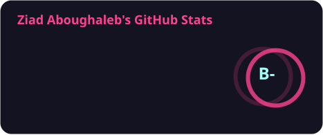
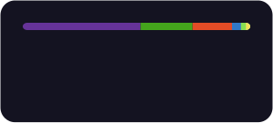

## Hi, I'm Ziad 👋

I'm a self-taught **Full-Stack MERN Developer** passionate about building modern, performant, and user-focused web applications.

- 🚀 Building end-to-end applications with the **MERN Stack**
- ⚛️ Creating responsive and intuitive user interfaces with **React** & **Next.js**
- ⚙️ Developing scalable backend APIs with **Node.js**, **Express**, and **MongoDB**
- 🌱 Continuously learning and improving through real-world projects
- 💼 Open to **full-time**, **freelance**, and **collaboration** opportunities

---

# 🚀 Tech Stack

### 🎨 Frontend

### ⚙️ Backend

---

# Tools

---

# GitHub Stats

---

